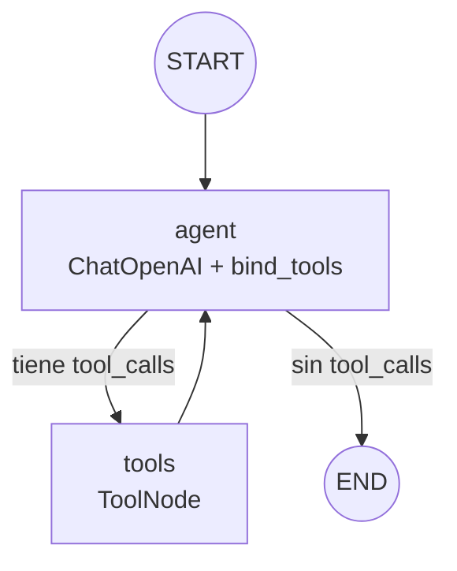

# react-agent-persistent-memory

Pre-entrega 5 del curso de AI Engineering: un agente de razonamiento cíclico
(ReAct) construido con LangGraph, que decide autónomamente cuándo usar
herramientas, encadena varias invocaciones para resolver una pregunta, y
recuerda conversaciones anteriores gracias a un checkpointer SQLite
persistido en disco.

## Qué hace

El agente responde preguntas sobre clientes y sus pedidos usando un dataset
ficticio en memoria (`tools.py`). Para responder algo como *"¿cuántos
pedidos tuvo Juan Pérez y cuánto gastó?"* necesita encadenar dos
herramientas: primero resolver el nombre a un `cliente_id`, después consultar
los pedidos con ese id. Esa dependencia entre herramientas es justamente lo
que obliga al razonamiento multi-paso — no hay forma de responder con una
sola invocación.

## Arquitectura del grafo

`StateGraph` con dos nodos (`agent`, `tools`) y una arista condicional que
LangGraph resuelve automáticamente con `tools_condition`: si la última
respuesta del modelo trae `tool_calls`, va a `tools`; si no, corta a `END`.
No hay ningún `if/else` de ruteo manual — el propio modelo decide, turno a
turno, si necesita una herramienta o si ya puede responder.



El estado (`AgentState` en `agent.py`) hereda de `MessagesState` y le suma
`tool_call_count`, un contador informativo de cuántas herramientas ya se
ejecutaron en la conversación (útil para inspeccionar el razonamiento
multi-paso en la traza sin contar mensajes a mano).

## Las herramientas

- **`buscar_cliente(nombre)`**: resuelve un nombre parcial o completo a un
  `cliente_id`. Si hay una coincidencia exacta o una coincidencia parcial
  única, devuelve el id. Si el nombre es ambiguo (por ejemplo "López", que
  matchea a dos clientes) o no coincide con nadie, la herramienta **no
  falla**: devuelve un mensaje explicándolo y, si aplica, la lista de
  candidatos. Ese mensaje es lo que le permite al agente pedir una
  aclaración en vez de inventar un id.
- **`buscar_pedidos(cliente_id)`**: devuelve cantidad de pedidos, total
  gastado y el último pedido de un cliente ya identificado.

Ambas usan `args_schema` de Pydantic (`extra="forbid"`, rangos y longitudes
mínimas validados) y devuelven strings pensados para que el modelo los lea y
decida el próximo paso, nunca errores crudos: cualquier excepción interna se
loguea con `logging` y se traduce a un mensaje genérico, sin exponer detalles
de implementación.

### Ciclo de retorno (retry / aclaración)

Cuando `buscar_cliente` devuelve un resultado ambiguo o "no encontrado", el
system prompt le indica al agente que no invente datos: debe pedirle al
usuario que precise la información, o reintentar con un dato mejor si lo
tiene. Esto se ve en el turno 3 de la demo (nombre ambiguo "López") y está
cubierto por tests con un modelo scripteado.

## Persistencia y memoria

El grafo se compila con un checkpointer SQLite atado a un `thread_id`. Todas
las invocaciones con el mismo `thread_id` comparten historia: el agente
puede responder "¿y cuál fue su último pedido?" sin que el usuario repita el
nombre, porque recupera el contexto del turno anterior desde el checkpoint.

### Nota sobre el checkpointer: `SqliteSaver` vs `AsyncSqliteSaver`

El checklist del curso menciona `SqliteSaver`. En la práctica, `SqliteSaver`
es **sincrónico**: si el grafo se invoca con `ainvoke`/`astream` (como acá,
porque las herramientas son `async` y el resto del código es asyncio de
punta a punta), `SqliteSaver` lanza:

```
NotImplementedError: The SqliteSaver does not support async methods.
Consider using AsyncSqliteSaver instead.
```

Por eso este repo usa `AsyncSqliteSaver` (`langgraph.checkpoint.sqlite.aio`):
es la variante async del mismo paquete (`langgraph-checkpoint-sqlite`),
persiste al mismo tipo de archivo `.db`, y se usa como context manager
asíncrono:

```python
async with AsyncSqliteSaver.from_conn_string(ruta_db) as checkpointer:
    grafo = build_graph(checkpointer)
    ...
```

## Cómo levantar el entorno

Requiere Python 3.12 y [`uv`](https://docs.astral.sh/uv/).

```bash
# 1. Clonar el repo y entrar
cd react-agent-persistent-memory

# 2. Crear el entorno virtual e instalar dependencias (incluye dev)
uv sync --all-groups

# 3. Copiar el archivo de entorno y completar tu API key real
cp .env.example .env
# editar .env y poner OPENAI_API_KEY=sk-...
```

## Cómo correr la demo

```bash
uv run python run_demo.py
```

Esto corre 3 turnos de conversación sobre el mismo `thread_id`:

1. **Multi-paso**: pregunta que obliga a encadenar `buscar_cliente` y
   `buscar_pedidos`.
2. **Memoria**: una repregunta que no vuelve a nombrar al cliente — el
   agente tiene que recuperar el contexto del checkpoint.
3. **Ciclo de retorno**: un nombre ambiguo, para mostrar que el agente pide
   aclaración en vez de inventar.

Al final, el script **reabre el checkpointer desde disco en un contexto
nuevo** (otro `async with AsyncSqliteSaver.from_conn_string(...)`) y llama a
`aget_state` para probar que el estado persistido sigue ahí — la prueba más
fuerte de que la memoria es real y no solo un objeto en memoria RAM del
mismo proceso.

## Dónde está la traza

- `traces/react_trace.json` — traza estructurada (por turno, lista de
  mensajes con `type`, `content`, `tool_calls`, `name`).
- `traces/react_trace.log` — el mismo contenido en formato legible.

La traza commiteada en este repo se generó **offline**, con
`uv run python generate_example_trace.py`: corre el mismo grafo, las mismas
herramientas y el mismo checkpointer reales, pero con un chat model
scripteado (`tests/fakes.py`) en lugar de OpenAI, siguiendo el guion descripto
arriba. El primer elemento del JSON lo aclara explícitamente. Correr
`run_demo.py` con una `OPENAI_API_KEY` real sobreescribe esos archivos con
una traza equivalente, pero con razonamiento genuino del modelo.

## Tests

```bash
uv run pytest --cov --cov-branch
```

Los tests no requieren red ni API key (un fixture autouse en
`tests/conftest.py` bloquea sockets y limpia `OPENAI_API_KEY`). El grafo se
testea con un chat model fake y determinístico (`tests/fakes.py`) que emite
`tool_calls` pre-programados, para validar que el ciclo agente → tools →
agente cierra correctamente sin depender de un LLM real.

## Resultados de la corrida

Gates de calidad:

```
ruff format --check .        13 files already formatted
ruff check .                 All checks passed!
pyright                      0 errors, 0 warnings, 0 informations
pytest --cov --cov-branch    43 passed — 100% coverage (agent, run_demo, settings, tools)
```

Demo real contra `gpt-4o-mini`, con la traza completa en
[`traces/react_trace.json`](traces/react_trace.json).

**Turno 1 — razonamiento multi-paso.** El agente encadena las dos
herramientas: no puede consultar pedidos sin resolver antes el nombre a un id.

```
Usuario: ¿Cuántos pedidos tuvo Juan Pérez y cuánto gastó en total?
  [ai]   buscar_cliente(nombre='Juan Pérez')
  [tool] Cliente encontrado: Juan Pérez (cliente_id=1)
  [ai]   buscar_pedidos(cliente_id=1)
  [tool] Juan Pérez tiene 2 pedido(s), gastó un total de $875.00.
         Último pedido: Mouse por $25.00 el 2026-05-14.
  [ai]   Juan Pérez tuvo 2 pedidos y gastó un total de $875.00. Su último
         pedido fue un mouse por $25.00 el 14 de mayo de 2026.
```

El `cliente_id=1` del segundo llamado sale del resultado del primero, no del
prompt.

**Turno 2 — memoria por `thread_id`.** La repregunta no nombra al cliente y se
responde sin volver a consultar herramientas: el contexto viene del
checkpoint.

```
Usuario: ¿Y cuál fue su último pedido?
  [ai]   El último pedido de Juan Pérez fue un mouse por $25.00, realizado el
         14 de mayo de 2026.
```

**Turno 3 — ciclo de retorno.** Ante información incompleta, el agente pide
aclaración en lugar de adivinar.

```
Usuario: Ahora quiero lo mismo pero para López.
  [ai]   buscar_cliente(nombre='López')
  [tool] El nombre 'López' es ambiguo o no es exacto. Candidatos posibles:
         María López, Marta López.
  [ai]   El nombre "López" es ambiguo... ¿Podrías especificar a cuál de ellas
         te referís?
```

**Persistencia en disco.** Al terminar los tres turnos, la demo cierra el
checkpointer y vuelve a abrir `checkpoints.db` en un contexto nuevo:

```
--- Estado recuperado desde disco: 12 mensajes ---
```
